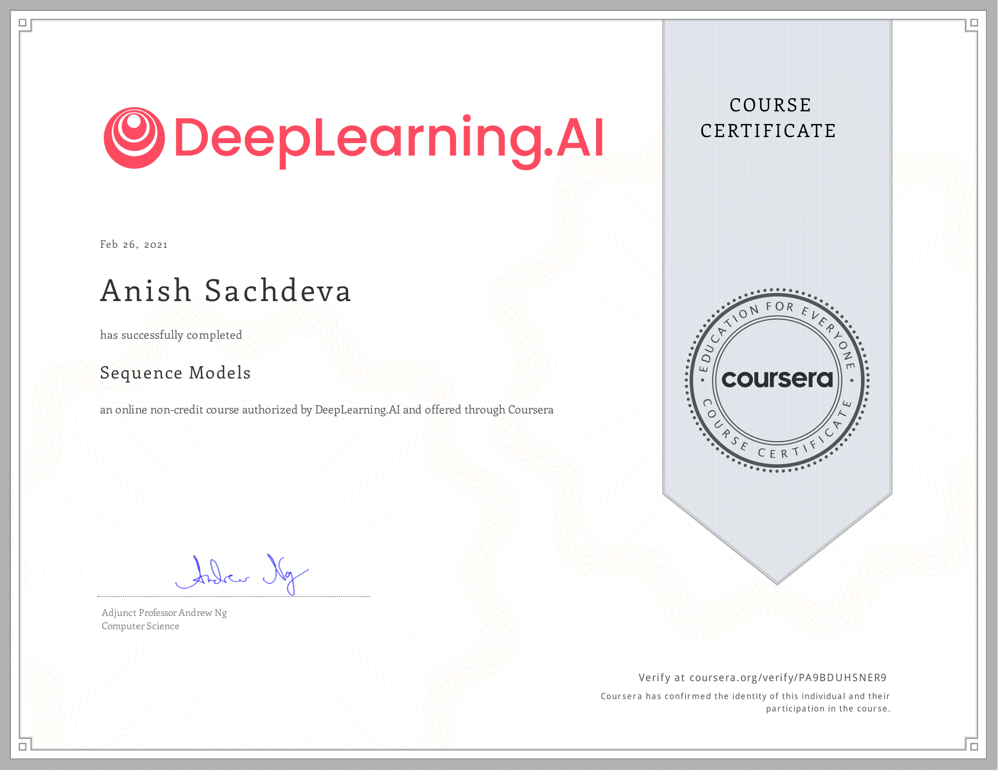

# Sequence Models @Coursera

__Course by deeplearning.ai__

This is part of the 5 course specialization on 
[Deep Learning](https://github.com/anishLearnsToCode/deep-learning-ai) 
on Coursera. This is the fourth course.

## 📖 Overview
- [Week 1](#week-1---recurrent-neural-networks)
- [Week 2](#week-2---natural-language-processing-and-word-embeddings)
- [Week 3](#week-3---sequence-model--attention-mechanism)
- [Certificate](#-certificate)

## Week 1 - Recurrent Neural Networks
- [__Quiz__ - Recurrent Neural Networks](week_1/quiz/quiz.md)
- [__Programming Assignment__ - Building a Recurrent Neural Network Step By Step](week_1/building-recurrent-nn-step-by-step/Building_a_Recurrent_Neural_Network_Step_by_Step_v3b.ipynb)
- [__Programming Assignment__ - Dinosaur Island - Character Level Language Modelling](week_1/dinasour-island-character-level-language-modelling/Dinosaurus_Island_Character_level_language_model_final_v3b.ipynb)
- [__Programming Assignment__ - Jazz Improvisation with LSTM](week_1/jazz-improv-with-lstm/Improvise_a_Jazz_Solo_with_an_LSTM_Network_v3a.ipynb)

## Week 2 - Natural Language Processing and Word Embeddings
- [__Quiz__ - Natural Language Processing & Word Embeddings](week_2/nlp-word-embeddings-quiz/quiz.md)
- [__Programming Assignment__ - Operations On Word Vectors - Debaising](week_2/word-vector-representation/Operations_on_word_vectors_v2a.ipynb)
- [__Programming Assignment__ - Emojify](week_2/emojify/Emojify_v2a.ipynb)

## Week 3 - Sequence Model & Attention Mechanism
- [__Quiz__ - Sequence Models & Attention Mechanism](week_3/sequence-models-attn-mechanism-quiz/quiz.md)
- [__Programming Assignment__ - Neural Machine Translation with Attention Mechanism](week_3/machine-translation/Neural_machine_translation_with_attention_v4a.ipynb)
- [__Programming Assignment__ - Trigger Word Detection](week_3/trigger-word-detection/Trigger_word_detection_v1a.ipynb)

## 🎓 [Certificate](https://coursera.org/verify/PA9BDUHSNER9)

